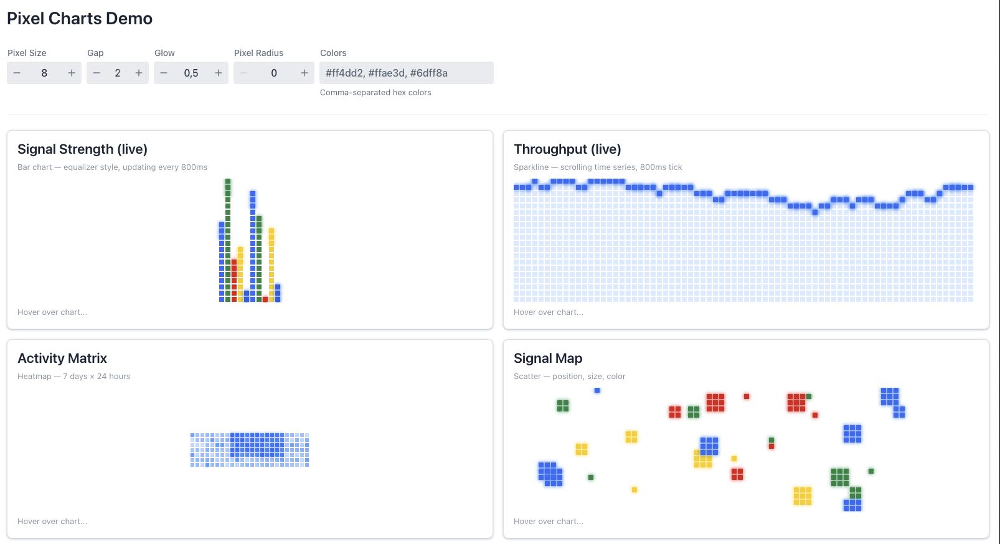
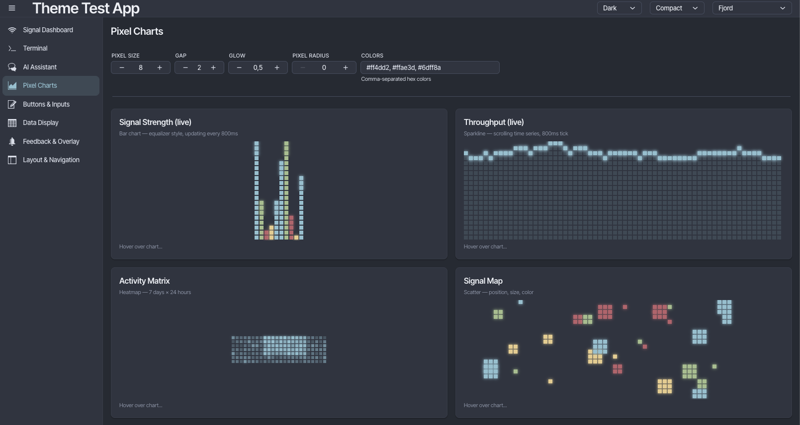
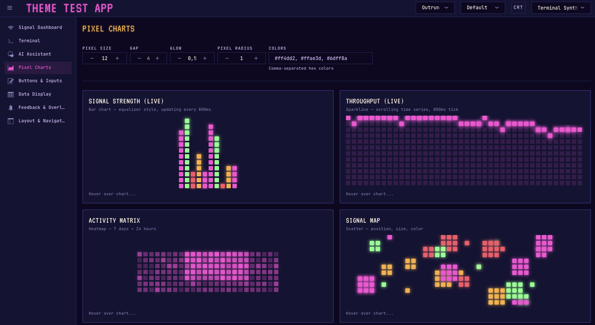

# vaadin-pixel-charts

Pixel-art chart components for Vaadin — bar, sparkline, heatmap, scatter. Canvas-rendered with configurable pixel size,
gap, corner radius, glow intensity, and hover crosshair. Theme-aware via `--lumo-*` CSS variables.



Although the component should work out of the box with standard Lumo themes, it's meant to be used with themes providing
a bit more "pop" to the screen.
Exemples with themes from https://github.com/adumeige/vaadin-themes :

**Fjord**



**Terminal Synth**



## Modules

| Module                       | Description                                    |
|------------------------------|------------------------------------------------|
| `vaadin-pixel-charts`        | Component library (Java + LitElement/TS)       |
| `vaadin-pixel-charts-karibu` | Karibu DSL extension functions (Kotlin)        |
| `vaadin-pixel-charts-demo`   | Spring Boot demo app with live data simulation |

## Usage

```xml

<dependency>
    <groupId>org.antoined</groupId>
    <artifactId>vaadin-pixel-charts</artifactId>
    <version>0.0.1-SNAPSHOT</version>
</dependency>
```

```java
var chart = new PixelBarChart();
chart.

setItems(List.of(new BarItem("A", 0.8), new

BarItem("B",0.5)));
        chart.

setPixelSize(8);
chart.

setGap(2);
chart.

setGlowIntensity(0.6);
chart.

setPixelRadius(0);       // 0 = sharp squares, pixelSize/2 = circles
chart.

setHighlightEnabled(true);
chart.

addHoverListener(e ->{ /* e.getIndex(), e.getValue(), e.getLabel() */ });
```

### Karibu DSL

```xml

<dependency>
    <groupId>org.antoined</groupId>
    <artifactId>vaadin-pixel-charts-karibu</artifactId>
    <version>0.0.1-SNAPSHOT</version>
</dependency>
```

```kotlin
pixelBarChart {
    setHeight("200px")
    setGlowIntensity(0.8)
    setItems(listOf(BarItem("A", 0.9), BarItem("B", 0.5)))
}
```

## Chart types

- **PixelBarChart** — equalizer-style stacked pixel columns. Data: `List<BarItem(label, value)>`
- **PixelSparkline** — line with Bresenham interpolation + optional area fill. Data: `List<Double>`
- **PixelHeatmap** — 2D grid, color intensity by value. Data: `List<HeatmapCell(row, col, value)>`
- **PixelScatter** — positioned dots, variable size/color. Data: `List<ScatterPoint(x, y, size, colorIndex)>`

## Properties

| Property           | Default | Description                                        |
|--------------------|---------|----------------------------------------------------|
| `pixelSize`        | 8       | Side length of each pixel block (px)               |
| `gap`              | 2       | Space between blocks (px)                          |
| `glowIntensity`    | 0.5     | Glow strength (0–1), uses canvas `shadowBlur`      |
| `pixelRadius`      | 0       | Corner radius per pixel (0 = square, max = circle) |
| `highlightEnabled` | true    | Hover crosshair + radial glow effect               |
| `highlightRadius`  | 3       | Cells affected by radial hover glow                |
| `colors`           | theme   | Custom colors; falls back to `--lumo-*` variables  |
| `fillArea`         | true    | Sparkline only — fill below the line               |

## Colors

Colors resolve in order: `setColors(...)` > `--pixel-chart-color-1..5` CSS vars >
`--lumo-primary/success/error/warning-color`. Works with any Vaadin theme.

## Build

```sh
mvn install
cd vaadin-pixel-charts-demo
mvn spring-boot:run
```

## Maven packages

After the publishing workflow first succeeds on `main`, artifacts are available
from [GitHub Packages](https://github.com/adumeige/vaadin-pixel-charts/packages).
The workflow builds and tests with Java 21 on pull requests and pushes to `main`.
It publishes on pushes to `main`, or when manually dispatched on `main`, using
GitHub's automatic `GITHUB_TOKEN` with `packages: write`; no custom secret is needed.

Published JARs (group ID `org.antoined`, version `0.0.1-SNAPSHOT`):

- `vaadin-pixel-charts`
- `vaadin-pixel-charts-karibu`

The reactor parent POM is also published so consumers can resolve the JARs.
The demo application is excluded from this library build and publication.

Add the repository to your consuming project's `pom.xml`:

```xml
<repositories>
    <repository>
        <id>github-vaadin-pixel-charts</id>
        <url>https://maven.pkg.github.com/adumeige/vaadin-pixel-charts</url>
        <snapshots><enabled>true</enabled></snapshots>
    </repository>
</repositories>
```

GitHub requires authentication even for public Maven packages. Add a matching
server to your existing `~/.m2/settings.xml` (merge this into `<servers>`), using a
personal access token (classic) with `read:packages`:

```xml
<server>
    <id>github-vaadin-pixel-charts</id>
    <username>${env.GITHUB_ACTOR}</username>
    <password>${env.GITHUB_TOKEN}</password>
</server>
```

Set `GITHUB_ACTOR` to your GitHub username and `GITHUB_TOKEN` to your token;
keep the token outside the repository. Then add the desired dependency:

```xml
<dependency>
    <groupId>org.antoined</groupId>
    <artifactId>vaadin-pixel-charts</artifactId>
    <version>0.0.1-SNAPSHOT</version>
</dependency>
```

Run the same build locally with Java 21:

```sh
mvn -B -ntp -pl vaadin-pixel-charts,vaadin-pixel-charts-karibu -am verify
```

The current versions are snapshots. To publish a stable version, update the
reactor and child POM versions together before merging to `main`; published
release versions must be unique. Creating a Git tag does not change Maven versions
or trigger this workflow.
